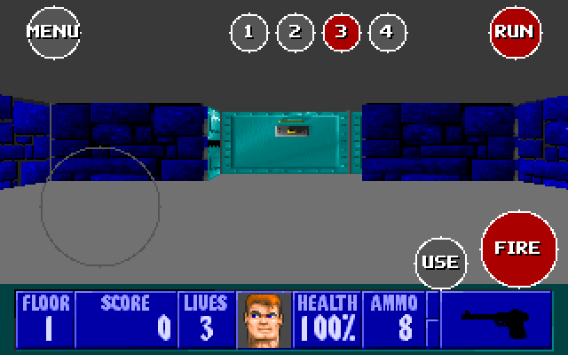

# ARWOLF

**ARWOLF** is the Android port of
[RWOLF](https://github.com/Wynplusplus/RWOLF), a clean-room reimplementation of
**Wolfenstein 3D** built with the [Bevy](https://bevyengine.org) engine. It
reads the original `WL6` data files that **you** supply and plays the original
maps, textures and digitised sounds through a from-scratch software raycaster,
with on-screen touch controls.

> **AI-generated.** ARWOLF was written entirely by an AI coding agent from the
> repository owner's prompts. Treat the code as unreviewed; there is no
> warranty. See [AI disclaimer](#ai-disclaimer).



> **No game content is included.** ARWOLF ships no Wolfenstein 3D data and no id
> Software code. You must provide your own legally obtained copy of the
> registered (WL6) files. *Wolfenstein 3D* is a trademark of its respective
> owners; this project is unofficial and is not affiliated with or endorsed by
> them.

## Install on Android

1. Download `ARWOLF-0.1.0.apk` from the
   [latest release](https://github.com/Wynplusplus/ARWOLF/releases/latest).
2. Install it. You will need to allow installation from unknown sources; the
   APK is signed with the standard Android **debug** key.
3. Push your own WL6 data to the device (see
   [Game data](#game-data-required)).

The APK contains both **arm64-v8a** (phones and tablets) and **x86_64**
(emulators) libraries. It uses the AOSP **NativeActivity** backend — there is no
Google Play Services or other Google library involved.

Minimum Android version is **8.0 (API 26)**, required by Bevy's AAudio audio
backend. The game runs in landscape.

## Game data (required)

ARWOLF ships no game data. On first launch it opens an in-app **folder
picker**: navigate to the folder that contains `VSWAP.WL6` and press **USE
THIS FOLDER**. The choice is saved and reused on the next launch.

On Android 11+ the picker needs **All files access** to read shared storage
such as `Download`. ARWOLF asks for it on first launch by opening the relevant
system settings page; you can also enable it manually in *Settings → Apps →
ARWOLF → Permissions → Files and media → Allow management of all files*. If a
folder cannot be read, the picker shows a **GRANT ACCESS** button. Without the
permission you can still use the app-specific folder below, which needs none.

Alternatively, push your legally obtained WL6 files to the app's external
files directory with the helper script:

```sh
android/push-data.sh /path/to/WOLF3D
```

or manually:

```sh
adb shell mkdir -p /sdcard/Android/data/io.github.wynplusplus.wolf3dbevy/files
adb push WOLF3D /sdcard/Android/data/io.github.wynplusplus.wolf3dbevy/files/
```

Expected files:

```
AUDIOHED.WL6  AUDIOT.WL6   GAMEMAPS.WL6  MAPHEAD.WL6
VGAHEAD.WL6   VGADICT.WL6  VGAGRAPH.WL6  VSWAP.WL6
```

The app searches, in order: `WOLF3D_DATA_DIR`, the folder chosen in the picker,
the `data_dir` from `wolf3d-bevy.toml`, the app-specific directory above,
`/sdcard/WOLF3D`, `/storage/emulated/0/WOLF3D` and
`/sdcard/Download/WOLF3D`.

## Controls

The on-screen gamepad is drawn over the 3D view:

| Control | Action |
| --- | --- |
| Left half (drag) | Movement stick: up/down moves, left/right turns |
| Right half (drag) | Turn |
| `MENU` | Open/close the level-select overlay |
| `FILES` | Open the game-folder picker (also `F` on desktop) |
| `1` `2` `3` `4` | Select weapon |
| `RUN` | Run while held |
| `FIRE` | Fire |
| `USE` | Open doors / use switches |

Tap a cell on the `MENU` overlay to pick an episode and floor, then `START`.

## Building for Android

Prerequisites:

```sh
rustup target add aarch64-linux-android x86_64-linux-android
cargo install cargo-apk
# Android SDK + NDK, then:
export ANDROID_HOME="$HOME/Android/Sdk"
export ANDROID_NDK_HOME="$ANDROID_HOME/ndk/<version>"
```

Build the APK:

```sh
cargo apk build --lib --release
```

`--lib` is required: the package also contains the desktop binary, which must
not be built for Android. The APK is written to
`target/release/apk/wolf3d-bevy.apk`. Build a single architecture with
`--target aarch64-linux-android` (or `x86_64-linux-android`).

Release builds must be signed. cargo-apk reads the keystore from
`[package.metadata.android.signing.release]` or from the
`CARGO_APK_RELEASE_KEYSTORE` and `CARGO_APK_RELEASE_KEYSTORE_PASSWORD`
environment variables. For a hobby release you can reuse the Android debug
keystore:

```sh
CARGO_APK_RELEASE_KEYSTORE="$HOME/.android/debug.keystore" \
CARGO_APK_RELEASE_KEYSTORE_PASSWORD="android" \
cargo apk build --lib --release
```

For a real release, generate your own keystore with `keytool` and keep it
private.

See [`android/README.md`](android/README.md) for more detail.

## Desktop

The same engine still builds and runs on the desktop (this is what RWOLF is):

```sh
cargo run --release
```

Desktop controls:

| Action | Key |
| --- | --- |
| Move / strafe | `W` `A` `S` `D` |
| Turn | mouse, or `←` `→` / `Q` `E` |
| Run | `Shift` |
| Fire | left mouse, or `Ctrl` |
| Use / open door | `Space` |
| Weapons | `1` `2` `3` `4` |
| Level-select menu | `Esc` |

A Flatpak manifest for the desktop build lives in [`flatpak/`](flatpak/); see
[`flatpak/README.md`](flatpak/README.md).

## Configuration

Copy `wolf3d-bevy.toml.example` to `wolf3d-bevy.toml` (next to the binary, or in
the directory you run from) to set the data directory and default
episode/floor/difficulty:

```toml
data_dir = "/path/to/WOLF3D"
# episode = 1
# map = 1
# difficulty = "normal"
```

On Android the environment variables (`WOLF3D_DATA_DIR`, `WOLF3D_EPISODE`,
`WOLF3D_MAP`, `WOLF3D_DIFFICULTY`) are usually not available, so the data
search path above is used instead.

## AI disclaimer

ARWOLF was written **entirely by an AI coding agent** (DeepSeek V4.1 Flash,
running in OpenCode) from the repository owner's natural-language prompts. The
owner specified the features and tested the results; the AI wrote all source
code, tests and documentation. As with any AI-generated code, treat it as
unreviewed: it may contain bugs, and there is no warranty.

## License

MIT. See [`LICENSE`](LICENSE). No game assets are included or licensed here.
